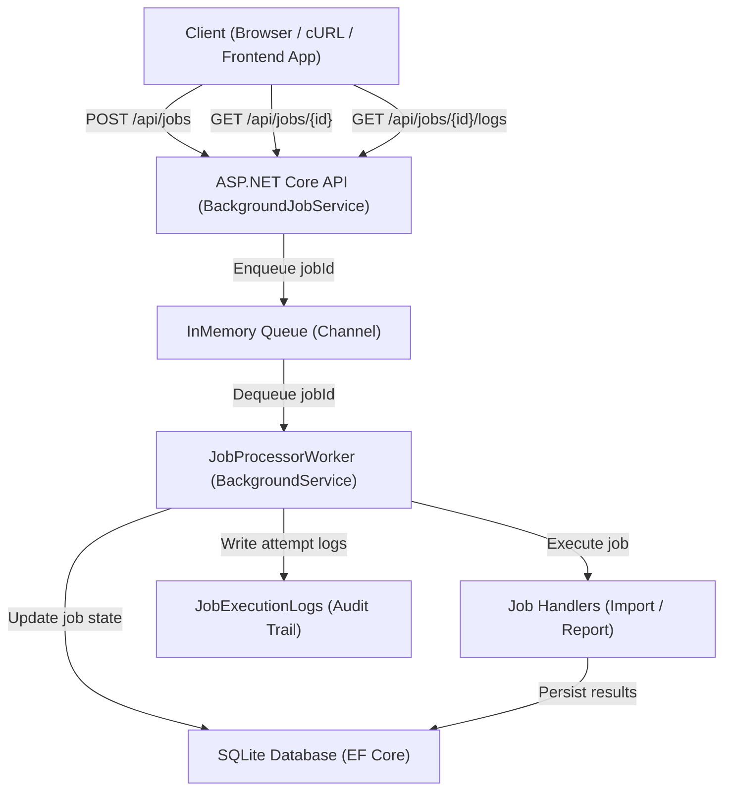

# Background Job & Task Processing Service (ASP.NET Core)

A lightweight background job processing service that demonstrates how to:

- Offload long-running work (imports / report generation) from HTTP requests
- Track job lifecycle and execution attempts in persistent storage
- Increase reliability with retry policies (exponential backoff)
- Improve observability with structured logs and per-attempt audit records

> This project is intentionally small but **production-shaped**: clear boundaries, persistence, retries, and debuggable execution history.

---

## System Architecture



## 🤔 Why This Exists

Synchronous APIs are a poor fit for long-running work:

- Requests time out
- Thread pool pressure increases
- Failures are difficult to retry and diagnose

This service accepts a job request, returns a `jobId` immediately, and executes the job asynchronously in a background worker.

---

## 🔌 API Overview

### Create Job

**POST** `/api/jobs`

#### Request

```json
{
  "type": "Import",
  "payload": {
    "fileName": "demo.csv",
    "rows": 1000
  },
  "maxAttempts": 3
}
```

#### Response

```json
{
  "jobId": "uuid",
  "statusUrl": "/api/jobs/uuid"
}
```

### Get Job Status

**GET** `/api/jobs/{id}`

#### Example Response

```json
{
  "id": "uuid",
  "type": "Import",
  "status": "Failed",
  "attemptCount": 3,
  "maxAttempts": 3,
  "lastError": "Simulated import failure based on payload."
}
```

### Get Execution Logs

**GET** `/api/jobs/{id}/logs`

#### Example Response

```json
[
  {
    "attemptNumber": 1,
    "succeeded": false,
    "error": "Simulated import failure based on payload.",
    "durationMs": 3012
  }
]
```

## 🧠 Design Notes

- Job execution is decoupled from HTTP requests
- Retry behavior is handled centrally using **Polly**
- Job handlers are extensible via `IJobHandler`
- Execution logs provide full observability
- Queue can be replaced by **Redis / RabbitMQ** later

---

## 🛠 Tech Stack

- ASP.NET Core (.NET 8)
- EF Core + SQLite
- Serilog
- Polly
- Swagger / OpenAPI


## 🚀 Local Development

```bash
dotnet restore
dotnet run
```


### Swagger UI

http://localhost:5042/swagger

---

## 👤 Author

Zixi Zhao

---

## 📄 License

MIT
